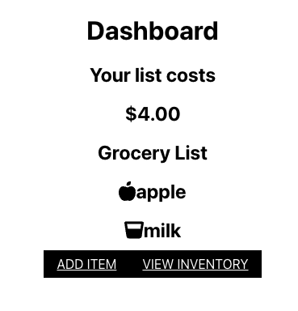

# Pantry PROVision

## Table of Contents
1. [Description](#description)
2. [Screenshot](#screenshot)
3. [Deployment](#deployment)
4. [License](#license)
5. [Questions](#questions)

## Description
This repository contains a kitchen pantry tracking, mobile centric application. Users can login and create, update and delete items that they like to keep in stock in their pantry. They can update inventory counts when items are purchased or consumed. They can also set thresholds of inventory counts before items will automatically appear on their shopping list. A total cost of items will be tallied for their current shopping list.

The technologies used in the development are: GraphQL API built with Apollo Server, MERN stack, with a React front end, MongoDB database, and Node.js/Express.js server and API.

Michael Cahill, Safia Traore, and Lisa Stillwell developed this application.

## Screenshot

## Deployment
This web application is deployed [HERE](https://secure-river-27449.herokuapp.com/)

## License
Please see https://opensource.org/licenses/BSD-3-Clause to get detailed information for this license

## Questions
You can find Michael [HERE](https://github.com/cahillmichael) on Github.

You can find Safia [HERE](https://github.com/straore98) on Github.

You can find Lisa [HERE](https://github.com/lstillwe) on Github.

You can email Michael at cahill.michael.p@gmail.com if you have any additional questions.

You can email Safia at safiatraore1@gmail.com if you have any additional questions.

You can email Lisa at lisastillwell@bellsouth.net if you have any additional questions.